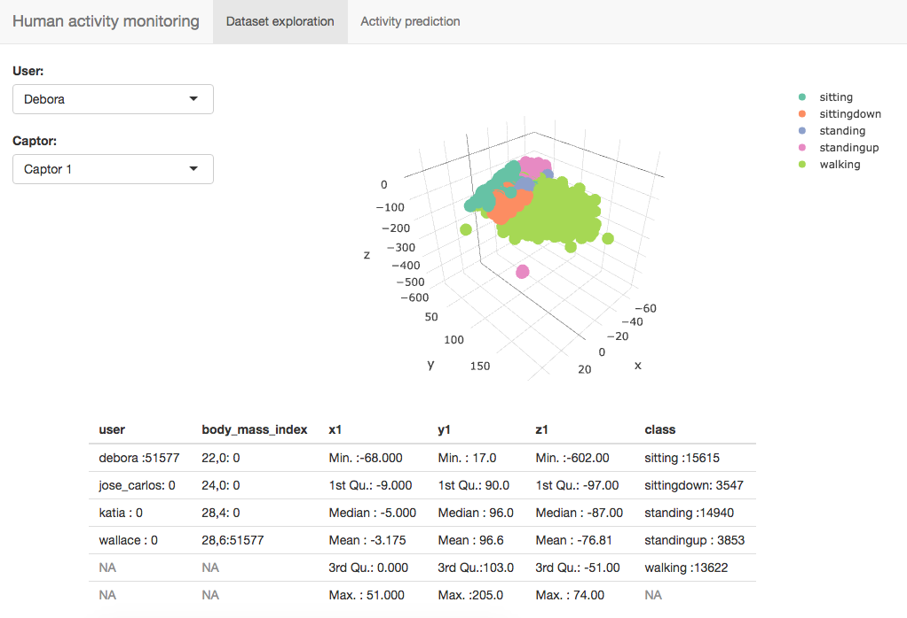
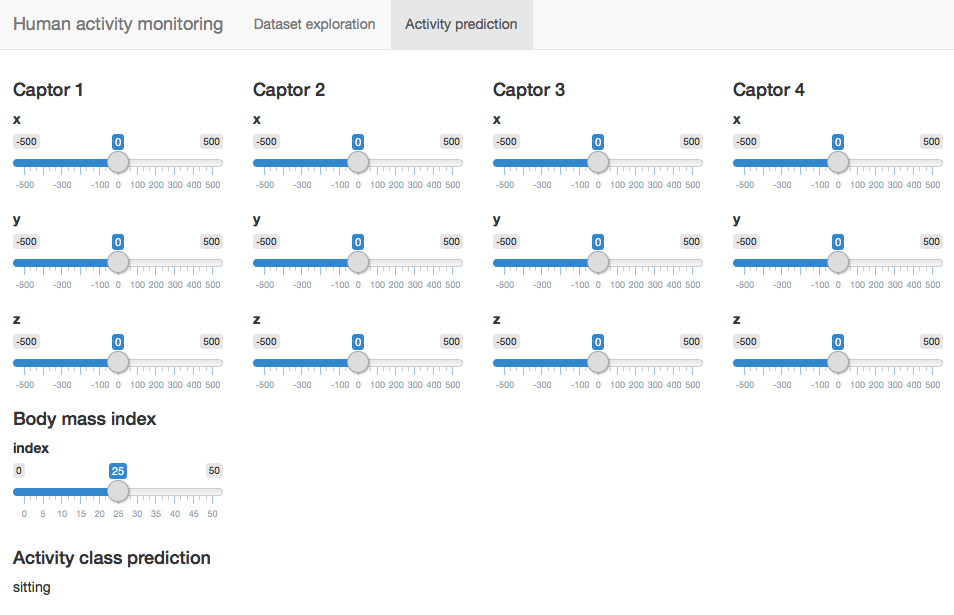

Human activity monitoring using Shiny
========================================================
author: olivier.vondach@obya.ch
date: July 1, 2017
autosize: true
transition: linear
transition-speed: slow

What is the Shiny App for and Where to Use It
========================================================
incremental: true

This app proposes data exploration and class prediction on the HAR dataset provided by [http://groupware.les.inf.puc-rio.br/har](http://groupware.les.inf.puc-rio.br/har).

- The Shiny app is hosted at [shinyapps.io](https://vondacho.shinyapps.io/human_activity_monitoring/).

- The source code and the supporting documentation are hosted at  [GitHub](https://github.com/vondacho/coursera-datascience-data-products/tree/master/human_activity_monitoring).

Input of the Shiny App
========================================================
incremental: true

The inputs or parameters users can specify during exploration include

- A member of the group of people engaged for the benchmarking
- One of the four captors used for the measurements

The inputs or parameters users can specify during prediction include

- The simulated values (x,y,z) of the four captors
- The simulated value of the body mass index

The interface of the Shiny App (exploration)
========================================================

The interface of the Shiny App (prediction)
========================================================

